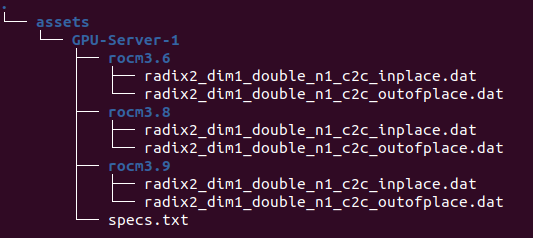

# AMD ROCm Performance Tracking Software 

## Introduction

AMD features one of the world's most sophisticated core processors in the world which is used for countless supercomputers around North America.  To keep up with the demand for better and faster products, many rapid upgrades to the software are needed, which makes quality control difficult.  Due to AMD’s lack of a regulated software testing platform, tracking the performance between updates is currently very time consuming.  The purpose of this project is to develop a platform for AMD to be able to test their product’s improvements in a timely manner, ensuring that they can keep up with the demand for their hardware.  This platform will feature tools to fetch and upload data to a database, where a dashboard will display visualizations of the data that allows a user to understand the performances of selected ROCm versions. This dashboard will have the capability of comparing the data of a test suite between its available versions, along with being able to visualize data for multiple ROCm libraries. To ensure that the database and the dashboard are flexible and easily manageable for the user, docker containers must be implemented. An overall timeline for this project puts the completion date around April 26th 2021, with plans for AMD to implement this dashboard for multiple ROCm libraries.

The project scope is to develop a framework capable of testing, tracking, storing changes and data on the ROCm pipelines to better organize and understand the needs of the community. This framework will measure performance of the math libraries by capturing results, historical trends, explore/query data, and visualize for further understanding. To meet these goals a python library will be created that features functions to parse the data from .dat files, format it accordingly, and then uploads it to a database.  It is important for this library to be compatible with all mainstream import mechanisms, such as pip or conda.  For the visualizations, a dashboard will be implemented to view the data in certain graphs that allow the user to interpret the data accordingly.  Due to time constraints, the dashboard will not be deployed on a web server but will be by AMD after this project’s timeline concludes.

## User Guide

### Docker

1. In order to start, run a CMD line as an adminsitrator
2. Navigate to the path of the folder the "docker-compose" file is in
3. Run the command: docker-compose up
4. Open a second CMD line and run it as an administrator
5. Optional step, if you want to check the status of the containers run the command : docker ps

There are two ways to access the data base
1) via terminal
	1.a)if on linux or Mac run command: sudo docker exec -it AMDcontainer bash
	1.b)if on windows run command: docker exec -it AMDcontainer bash
	2.) a line the says "Root"with a memory address pops up propmting to enter a command.
		Enter command: mongo
	3.) to view the data base enter command: showdb

2) via mongodb plugin for vscode
	1) go to extensions in vscode and search for mongodb plugin and download
	2) Once downloaded the mongodb icon will appear on the left side of your IDE
	3) click on the icon
	4) on the left side of the screen click "add a connection", a text bar will appear at the top of your ide
	5) copy and paste this link and hit enter: mongodb://127.0.0.1:27020

6. In order to stop the docker container from running, on the second terminal, type 'exit' and enter, then 'exit' and enter agian untill
	you have naviagted back to the root prompt
7. Run the command: docker stop AMDcontainer
8. you are now safe to close both terminals and all relevant windows

### Loading to the Database

This process works for the libraries FFT, Rand and Blas

1) Install pargo library in your project virtual environment
2) import the library parser class required (ie. FFTSuiteProcessor, BLASSuiteProcessor, RANDSuiteProcessor) from pargo.

	Ex. `from pargo.rand import RANDSuiteProcessor`
 
3) Instantiate the parser
	
	Ex. `rand = RANDSuiteProcessor()`
	
4) Call the libraries `activate_process` method on the instantiated object (`rand`)
	
	`rand.activate_process()`
	
	#### Specify the folder path
	1. Use the strict directory path argument in the activate_process method. Create a folder on your computer, ex "assets".
		1. `strict_dir_path = "path to assets folder"`
		2. An example for the folder structure:

		

		-The following can be changed to suite your needs:  
		
		-assets: the folder name  
		-GPU-Server-1: the name of the hardware you are running  
		-rocm3.6: the version of the test data  
		
	#### Specify file path	
	2. Use the dat_file_path argument in the `activate_process` method
		1. A single file path
		 	dat_file_path = "path to .dat files"

		2. A list of file paths
			dat_file_path = "path to .dat files"
	

 
			activate_process(self, *, platform: StringORNone = None,
					 dat_file_path: PATHListORStringORNone = None,
					 version: StringORNone = None,
					 specs_file_path: PATHString = None,
					 strict_dir_path: PATHString = None,
					 plots: List = None,
					 added_fields: Dictionary = None,
					 axis_titles: List = None) -> None:

5) For libraries that are not already implemented (ie, not fft, rand or blas), a new class needs to be created that inherits from the base class `LibrarySuiteProcessor` of pargo.  The process_data function must be overridden to suite the preprocessing needs of the library being added. For more information check section ____ of the maintenance guide.

### Running Dashboard

1) Download the "dynamic-responsive-dash" folder from the reopository
2) Ensure all dependiencies are installed in a project folder's virtual environment
3) Run app.py in an IDE of your choice
4) Follow the link that is generated by running app.py

## Maintenace guide
### Adding new ROCm libraries to the parser package

### Adding new functionalities to dash

### Updating the database

## Contributors

Ahmed Iqbal, Aidan Forester, Javier Vite, Victor Tuah Kumi
